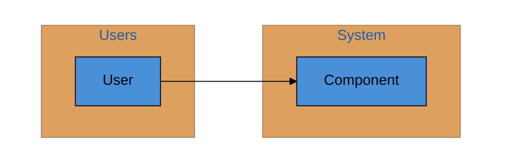

# Generate C4 Architecture Documentation

Generate or update C4 architecture documentation for any codebase through structured discovery and extraction.

## Instructions

You are generating or updating C4 model documentation for this codebase. This command uses a technology-agnostic approach: first understand the stack, then extract architecture data deterministically, then generate documentation.

---

## Phase 1: Discover Extraction Methods

Use the **brainstorming skill** to explore how architecture data can be extracted from this codebase:

1. Analyze the codebase to identify the technology stack
2. Brainstorm possible methods to extract:
   - **Components/Services**: What defines a component boundary in this codebase?
   - **Dependencies**: How can inter-component connections be discovered deterministically?
   - **Internal structure**: How can module-level dependencies within components be extracted?
3. Interview the user (via AskUserQuestion) to validate assumptions and fill gaps
4. Agree on extraction approach before proceeding

The goal is deterministic extraction—methods that can be re-run to regenerate accurate data.

---

## Phase 2: Extract Architecture Data

Execute the agreed extraction approach. Output should go to `docs/architecture/extracted/`.

---

## Phase 3: Validate with User

Present extracted data to user for review before generating diagrams. Confirm:
- All components are discovered
- Dependencies are accurate and complete
- No false positives or missing connections

---

## Phase 4: Analyze Architecture

### 4.1 Identify System Boundaries

From the extracted data and interview, identify:
- **Users/Actors**: Who interacts with the system?
- **Entry Points**: Which components receive external requests?
- **External Systems**: What does the system depend on externally?

### 4.2 Identify Container Types

Classify each service/component:
- **Web Application**: Serves HTTP, renders UI
- **API Service**: REST/GraphQL/gRPC endpoints
- **Worker/Job**: Background processing, queue consumers
- **Database**: Data storage
- **Message Broker**: Async communication
- **Library/Module**: Shared code, no independent deployment

### 4.3 Identify Module Patterns

Within each service, identify architectural layers:
- **API/Controllers**: Request handling
- **Domain/Business**: Core business logic
- **Data/Repository**: Data access
- **Infrastructure**: External integrations
- **Config**: Configuration management

---

## Phase 5: Generate C4 Documentation

### 5.1 `docs/architecture/c4-context.md` (Level 1)

Show the system boundary and external actors:
- Users (from interview: API users, admin users, etc.)
- External systems (from interview: databases, APIs, etc.)
- The system as a single box

### 5.2 `docs/architecture/c4-containers.md` (Level 2)

Show the deployable units from `services.json`:
- Each service/component
- Infrastructure components (databases, message brokers, caches)
- Connections between containers from `dependencies.json`

### 5.3 `docs/architecture/c4-components/` (Level 3)

One file per service showing internal modules:
1. Read `internal-deps/{service}.json`
2. Extract unique modules
3. Filter out self-references
4. Group modules into logical layers
5. Generate Mermaid diagram with all connections
6. Write prose descriptions

### 5.4 `docs/architecture/README.md`

Create an index with:
- Brief explanation of C4 model levels
- Links to each generated document
- Instructions for regenerating (referencing the extraction scripts)

---

## Mermaid Style Guide

Use consistent Mermaid diagram styling:
- Use `flowchart TB` for top-to-bottom flow
- Use subgraphs to group related components
- Include brief descriptions in node labels
- **Always wrap the entire diagram in a `subgraph WhiteBG[" "]` for white background**

Example template:

---

## Quality Guidelines

- **Explain "why" not just "what"** - Describe purpose, not just technical function
- **Include ALL dependencies** - Every edge in extracted data must appear in diagrams
- **Exclude only self-references** - Filter edges where `from == to`
- **Use consistent terminology** - Match names from extraction exactly
- **Cross-reference** - Link to related diagrams and existing documentation
- **Verify completeness** - Count diagram arrows against extracted dependency count

---

## Manual Sections

If a file contains `<!-- MANUAL-START -->` and `<!-- MANUAL-END -->` markers, preserve that content exactly when regenerating.

---

## Output Summary

After generating all files, provide:
- What was created/updated
- Components that may need additional documentation
- Suggestions for improving architecture docs
- Instructions for the user to run extraction scripts independently
